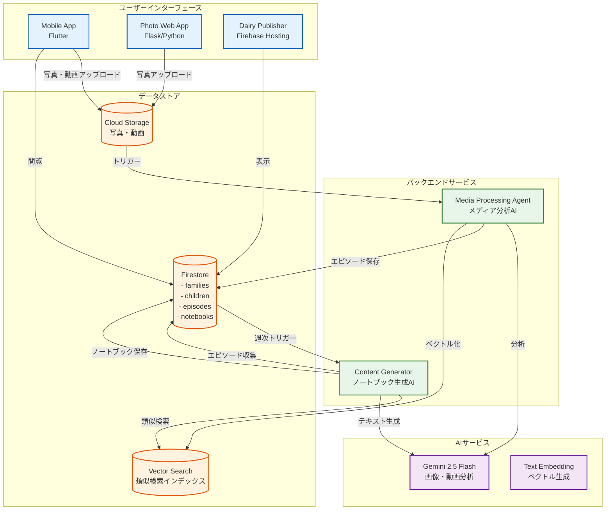

# Kids Diary (おまかせダイアリー) - 子供の成長記録自動化プラットフォーム

## 概要

Kids Diary（おまかせダイアリー）は、AI技術を活用して子供の日々の成長記録を自動化するプラットフォームです。写真や動画をアップロードするだけで、AIが自動的に分析・整理し、週次の成長記録ノートブックを生成します。親は大切な瞬間を見逃すことなく、手間をかけずに子供の成長を記録できます。

## 主な特徴

- 📸 **自動メディア分析**: AIが写真・動画から子供の行動や表情を自動分析
- 📖 **週次ノートブック生成**: 1週間の思い出を5つのテーマで自動整理
- 📰 **新聞風レイアウト**: 生成されたノートブックを美しい新聞風デザインで表示
- 👨‍👩‍👧‍👦 **家族共有**: URLベースで簡単に家族と共有
- 🔍 **高度な検索**: ベクトル検索による類似シーン・成長の軌跡を発見

## 全体アーキテクチャ



## コンポーネント構成

### 1. Mobile App (Flutter)
**役割**: メインのユーザーインターフェース  
**主要機能**:
- 家族・子供の管理
- 写真・動画のアップロード
- タイムライン表示
- ノートブック閲覧
- Google Sign-In認証

**技術スタック**: Flutter, Provider, Firebase SDK

### 2. Media Processing Agent
**役割**: アップロードされたメディアをAIで分析  
**主要機能**:
- 写真・動画から子供の行動や表情を分析
- 年齢に応じた多角的な視点での分析
- エピソードの構造化とタグ付け
- ベクトル検索用のインデックス作成

**技術スタック**: Python 3.12, Google ADK, Gemini 2.5 Flash

### 3. Content Generator
**役割**: 週次ノートブックの自動生成  
**主要機能**:
- 1週間分のエピソードを5つのテーマで整理
- AIによる温かい文章の生成
- ベクトル検索による関連エピソードの収集
- 画像の自動選択とキャプション生成

**技術スタック**: Python 3.12, Google ADK, Vertex AI

### 4. Dairy Publisher
**役割**: ノートブックを新聞風レイアウトで表示  
**主要機能**:
- 共有可能なWebページとして公開
- レスポンシブな新聞風デザイン
- URLベースの簡単共有

**技術スタック**: HTML/CSS/JavaScript, Firebase Hosting

### 5. Photo Web App
**役割**: Google Photosからの写真自動選別（開発中）  
**主要機能**:
- Google Photos連携
- 顔認識による特定人物の写真選別
- バッチアップロード

**技術スタック**: Python, Flask, Vertex AI

## データフローシナリオ

### 1. 日常の記録フロー
1. 親がモバイルアプリから写真・動画をアップロード
2. Media Processing Agentが自動的に内容を分析
3. 子供の行動、表情、場面を理解してエピソードを生成
4. エピソードがFirestoreに保存され、検索用インデックスを作成

### 2. 週次ノートブック生成フロー
1. 毎週月曜日にContent Generatorが自動起動
2. 前週のエピソードを収集・分析
3. 5つのテーマ（今週の興味、行った場所、初めての体験、ベストショット、できるようになったこと）で整理
4. AIが温かい文章でまとめてノートブックを生成

### 3. 共有フロー
1. 生成されたノートブックがDairy Publisherで公開
2. URLを家族に共有
3. 受け取った家族が新聞風レイアウトで閲覧

## 技術スタック

### 言語・フレームワーク
- **Frontend**: Flutter (Dart), HTML/CSS/JavaScript
- **Backend**: Python 3.12
- **AI Framework**: Google ADK (Agent Development Kit)

### Google Cloud Platform
- **Firestore**: NoSQLデータベース
- **Cloud Storage**: メディアファイル保存
- **Cloud Functions**: サーバーレス処理
- **Vertex AI**: AI/ML サービス
- **Firebase Hosting**: 静的サイトホスティング
- **Firebase Authentication**: 認証サービス

### AI/ML
- **Gemini 2.0/2.5 Flash**: マルチモーダル分析・テキスト生成
- **Text Embedding Model**: ベクトル化
- **Vector Search**: 類似検索

## セキュリティとプライバシー

- Google Sign-Inによる安全な認証
- 家族単位でのデータ隔離
- 環境変数による機密情報の管理
- Firestoreセキュリティルールによるアクセス制御

## セットアップ

### 前提条件
- Google Cloud Projectの作成
- Firebase プロジェクトの設定
- 必要なAPIの有効化
  - Vertex AI API
  - Firebase API
  - Cloud Storage API

### 環境変数
```bash
GCP_PROJECT_ID=your-project-id
GCP_LOCATION=us-central1
VERTEX_AI_VECTOR_SEARCH_INDEX_ID=your-index-id
VERTEX_AI_VECTOR_SEARCH_INDEX_ENDPOINT_ID=your-endpoint-id
```

### デプロイ
各コンポーネントのREADMEを参照してください。

## 今後の拡張予定

1. **PDF出力機能**: ノートブックのPDF化
2. **動画ハイライト**: 動画からの自動ハイライト抽出
3. **成長トレンド分析**: 長期的な成長傾向の可視化
4. **音声メモ対応**: 音声の文字起こしと統合
5. **多言語対応**: 英語など他言語への対応

## ライセンス

このプロジェクトは内部使用のみを目的としています。

## 貢献者

- [貢献者リスト]

---

Thank you for letting me work