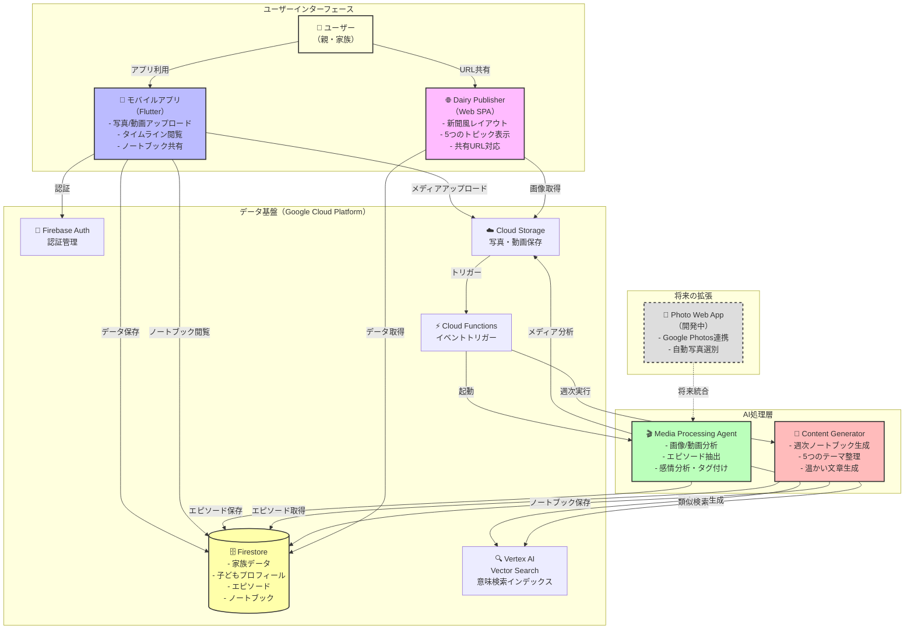

# おまかせダイアリー - Kids Diary Platform

## 概要

おまかせダイアリーは、子どもの成長記録を自動的に整理し、新聞風のレイアウトで週次ノートブックとして提供するプラットフォームです。親が撮影した写真や動画をアップロードするだけで、AIが内容を分析し、子どもの成長や思い出を自動的に記録・整理します。

## 主な特徴

- 📱 **簡単な写真・動画アップロード**: モバイルアプリから簡単に思い出を記録
- 🤖 **AI による自動分析**: アップロードされたメディアから成長記録を自動抽出
- 📰 **週次ノートブックの自動生成**: 毎週月曜日に新聞風レイアウトで思い出をまとめ
- 👨‍👩‍👧‍👦 **家族での共有**: URLを共有するだけで、離れた家族も成長記録を閲覧可能
- 🔍 **賢い検索機能**: ベクトル検索により、関連する思い出を自動的に関連付け

## システム全体アーキテクチャ



## コンポーネント概要

### 1. モバイルアプリ（Mobile App）
- **役割**: メインのユーザーインターフェース
- **技術**: Flutter（クロスプラットフォーム対応）
- **機能**: 
  - 家族・子どもプロフィール管理
  - 写真・動画の撮影とアップロード
  - AIが分析したエピソードのタイムライン表示
  - 週次ノートブックの閲覧と共有

### 2. メディア処理エージェント（Media Processing Agent）
- **役割**: アップロードされたメディアをAIで分析
- **技術**: Python + Google ADK + Gemini AI
- **機能**:
  - 年齢に応じた成長観点での分析
  - 感情的な日本語タイトルの生成
  - 検索用タグとベクトル埋め込みの作成

### 3. コンテンツジェネレーター（Content Generator）
- **役割**: 週次ノートブックの自動生成
- **技術**: Python + Google ADK + Gemini AI
- **機能**:
  - 1週間のエピソードを5つのテーマに整理
  - 親向けの温かい文章生成（200-300文字）
  - 関連エピソードの自動関連付け

### 4. ダイアリーパブリッシャー（Dairy Publisher）
- **役割**: 成長記録の新聞風ビューアー（閲覧専用インターフェース）
- **技術**: Vanilla JavaScript (ES6+) + CSS3 + Firebase Hosting
- **機能**:
  - 新聞風レイアウトで5つのトピックを美しく表示
  - URLパラメータベースのルーティング（/children/:childId/notebooks/:notebookId）
  - レスポンシブデザイン（モバイル対応）
  - Firebase SDKによるリアルタイムデータ取得
  - エラーハンドリングとローディングアニメーション

### 5. フォトWebアプリ（Photo Web App）※開発中
- **役割**: Google Photosからの自動写真収集
- **技術**: Python + Flask + Google Photos API
- **機能**:
  - 顔認識による特定の子どもの写真抽出
  - 将来的にメディア処理エージェントと統合予定

## データフロー

1. **メディアアップロード**: 親がモバイルアプリで写真・動画をアップロード
2. **AI分析**: Media Processing Agentが内容を分析し、成長記録を抽出
3. **データ保存**: エピソードとしてFirestoreに保存、検索用ベクトルも生成
4. **週次生成**: 毎週月曜日にContent Generatorが1週間分をまとめてノートブック作成
5. **閲覧・共有**: モバイルアプリやWebで閲覧、URLで家族と共有

## 技術スタック

- **フロントエンド**: Flutter（モバイル）、HTML/CSS/JS（Web）
- **バックエンド**: Python 3.12、Google ADK
- **AI/ML**: Gemini 2.5 Flash、Vertex AI、text-embedding-004
- **インフラ**: Google Cloud Platform
  - Firebase（Auth, Firestore, Storage, Hosting）
  - Cloud Functions
  - Vertex AI Vector Search
- **開発ツール**: Git、Firebase CLI、gcloud CLI

## セキュリティとプライバシー

- Google認証によるセキュアなログイン
- 家族単位でのデータ分離
- URLベースの共有（認証不要だが、URLを知っている人のみアクセス可能）
- 子どもの写真は家族メンバーのみがアクセス可能

## 今後の展望

- Google Photos連携による自動写真収集
- Firebase FunctionsによるPDFエクスポート機能
- Vertex AIを使用した自動要約生成
- 認証機能の追加（プライベート共有）
- PWA対応（オフライン閲覧）
- より高度なAI分析（発達段階の詳細な追跡など）
- 多言語対応
- プッシュ通知機能

## プロジェクト構成

```
hackason/
├── mobile/                    # Flutterモバイルアプリ
├── media_processing_agent/    # メディア分析AIエージェント
├── content_generator/         # ノートブック生成AIエージェント
├── dairy_publisher/          # Web表示用静的サイト
├── photo_web_app/           # Google Photos連携アプリ（開発中）
└── CLAUDE.md                # プロジェクト設定
```

各コンポーネントの詳細なアーキテクチャについては、それぞれのディレクトリ内のarchitecture.mdファイルを参照してください。

## 開発環境

- Python 3.12
- Flutter SDK
- Google Cloud Platform アカウント
- Firebase プロジェクト（hackason-464007）

## ライセンス

このプロジェクトは内部利用を目的としています。