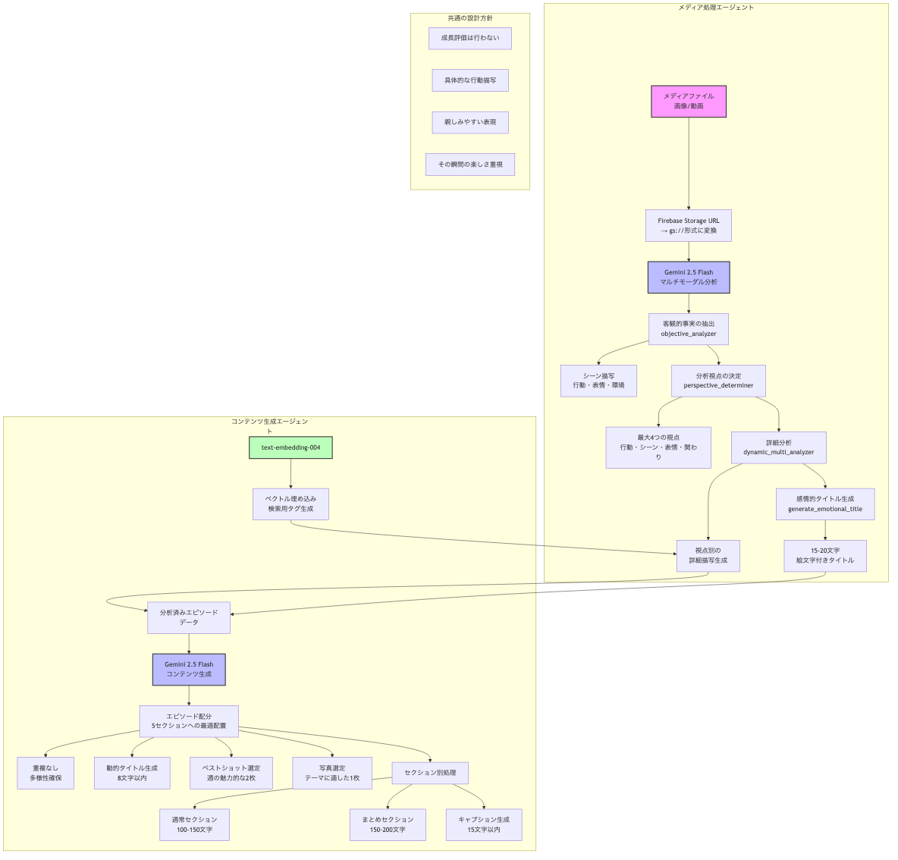

# システムアーキテクチャ概要

## プロジェクト概要
子供の写真・動画から自動的に成長記録を生成するAIシステム

## システム構成

### 1. メディア処理エージェント (media_processing_agent)
**役割**: アップロードされた写真・動画を分析し、具体的なシーン情報を抽出

#### 主要コンポーネント
- **客観的事実の抽出器** (objective_analyzer)
  - 子供の行動、表情、環境を客観的に記録
  - JSON形式で構造化データを出力
  
- **分析視点決定器** (perspective_determiner)
  - 最大4つの分析視点を自動選択
  - 行動、シーン、表情、物との関わりなど
  
- **詳細分析器** (dynamic_multi_analyzer)
  - 各視点から詳細な描写を生成
  - 検索用タグを付与
  
- **タイトル生成器** (generate_emotional_title)
  - 15-20文字の親しみやすいタイトル
  - 絵文字付きで感情豊かに表現

### 2. コンテンツ生成エージェント (content_generator)
**役割**: 分析されたエピソードから週間ノートブックを自動生成

#### 主要機能
- **エピソード配分**: 5つのセクションに最適配置
- **動的タイトル生成**: 8文字以内の自然なタイトル
- **ベストショット選定**: 週の中で最も魅力的な2枚
- **セクション別文章生成**: 100-200文字の描写文
- **キャプション生成**: 15文字以内の写真説明

### 3. モバイルアプリ (mobile)
**役割**: ユーザーインターフェースとメディアアップロード

#### 技術スタック
- Flutter (クロスプラットフォーム開発)
- Firebase連携
- カメラ・ギャラリー統合

## データフロー

```
1. ユーザーが写真/動画をアップロード
   ↓
2. Firebase Storageに保存
   ↓
3. メディア処理エージェントが分析
   ↓
4. エピソードデータをFirestoreに保存
   ↓
5. コンテンツ生成エージェントが週間ノートブック作成
   ↓
6. ユーザーがアプリで閲覧
```

## LLM処理フロー図



## 使用技術

### AI/ML
- **Gemini 2.5 Flash**: マルチモーダル分析と文章生成
- **text-embedding-004**: ベクトル埋め込みと検索機能
- **Vertex AI**: Google CloudのAIプラットフォーム

### インフラストラクチャ
- **Firebase**
  - Cloud Functions: サーバーレス処理
  - Firestore: NoSQLデータベース
  - Storage: メディアファイル保存
  - Authentication: ユーザー認証
  
- **Google Cloud Platform**
  - Vertex AI: LLM処理
  - Cloud Storage: 大容量ストレージ
  - Cloud Run: コンテナ実行環境

### 開発言語・フレームワーク
- **Python 3.12**: バックエンド処理
- **Flutter/Dart**: モバイルアプリ開発
- **TypeScript**: Cloud Functions (一部)

## 主要な設計方針

### 1. 客観的な記録
- 成長や発達の評価は行わない
- 観察可能な事実のみを記録
- その瞬間の楽しさや魅力を重視

### 2. 親しみやすい表現
- 「です・ます」調の丁寧な文体
- 具体的で分かりやすい描写
- 絵文字を効果的に使用

### 3. プライバシーとセキュリティ
- ユーザー認証による保護
- 家族間でのみ共有可能
- データの暗号化

### 4. スケーラビリティ
- サーバーレスアーキテクチャ
- 非同期処理による効率化
- キャッシュ戦略の実装

## エラーハンドリング

### メディア処理
- 不正なファイル形式の検出
- アクセス権限の確認
- 処理失敗時の再試行

### LLM処理
- JSON解析エラーの対処
- タイムアウト処理
- フォールバック戦略

## 今後の拡張予定

1. **リアルタイム処理**
   - 動画のストリーミング分析
   - 即座のフィードバック生成

2. **高度な検索機能**
   - 自然言語での検索
   - 類似シーンの発見

3. **共有機能の強化**
   - 祖父母との簡単共有
   - プリント注文機能

4. **多言語対応**
   - 英語版の提供
   - 他言語への展開

## 開発環境セットアップ

### 必要な環境
- Python 3.12
- Flutter SDK
- Firebase CLI
- Google Cloud SDK

### 環境変数
```bash
GOOGLE_CLOUD_PROJECT=your-project-id
GOOGLE_CLOUD_LOCATION=us-central1
FIREBASE_STORAGE_BUCKET=your-bucket-name
```

### 初期設定
1. Firebase プロジェクトの作成
2. GCP プロジェクトの設定
3. Vertex AI APIの有効化
4. 認証情報の設定

## 監視とロギング

- Cloud Loggingによる集中ログ管理
- エラー率の監視
- パフォーマンスメトリクスの追跡
- コスト最適化の継続的改善

## ドキュメント

- [メディア処理エージェント仕様](./media_processing_agent/llm.md)
- [コンテンツ生成エージェント仕様](./content_generator/llm.md)
- [モバイルアプリ設計要件](./mobile/DESIGN_REQUIREMENTS.md)