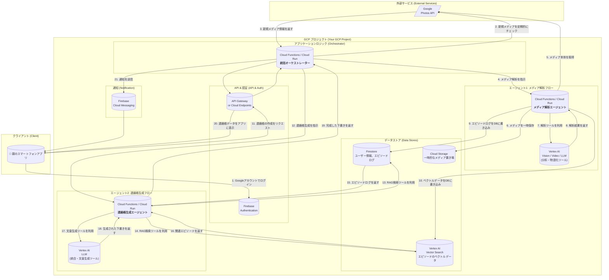

# アーキテクチャ図

```mermaid
graph TD
    subgraph "外部サービス (External Services)"
        GP[/"Google<br>Photos API"/]
    end

    subgraph "クライアント (Client)"
        UserApp[("📱 親のスマートフォンアプリ")]
    end

    subgraph "GCP プロジェクト (Your GCP Project)"

        subgraph "API & 認証 (API & Auth)"
            Auth[("Firebase<br>Authentication")]
            APIGW[("API Gateway<br>or Cloud Endpoints")]
        end

        subgraph "アプリケーションロジック (Orchestrator)"
            Orchestrator[("Cloud Functions / Cloud Run<br><b>統括オーケストレーター</b>")]
        end

        subgraph "データストア (Data Stores)"
            FS[("Firestore<br>ユーザー情報、エピソードログ")]
            VS[("Vertex AI<br>Vector Search<br>エピソードのベクトルデータ")]
            GCS[("Cloud Storage<br>一時的なメディア置き場")]
        end

        subgraph "エージェント1: メディア解析フロー"
            Agent1[("Cloud Functions / Cloud Run<br><b>メディア解析エージェント</b>")]
            V_AI_1[("Vertex AI<br>Vision / Video / LLM<br>(分析・物語化ツール)")]
        end

        subgraph "エージェント2: 連絡帳生成フロー"
            Agent2[("Cloud Functions / Cloud Run<br><b>連絡帳生成エージェント</b>")]
            V_AI_2[("Vertex AI<br>LLM<br>(統合・文章生成ツール)")]
        end
        
        subgraph "通知 (Notification)"
            FCM[("Firebase<br>Cloud Messaging")]
        end

    end

    %% --- フローの定義 ---
    
    %% フロー1: メディア解析 (青い矢印のイメージ)
    UserApp -- "1. Googleアカウントでログイン" --> Auth
    Orchestrator -- "2. 新規メディアを定期的にチェック" --> GP
    GP -- "3. 新規メディア情報を返す" --> Orchestrator
    Orchestrator -- "4. メディア解析を指示" --> Agent1
    Agent1 -- "5. メディア本体を取得" --> GP
    Agent1 -- "6. メディアを一時保存" --> GCS
    Agent1 -- "7. 解析ツールを利用" --> V_AI_1
    V_AI_1 -- "8. 解析結果を返す" --> Agent1
    Agent1 -- "9. エピソードログをDBに書き込み" --> FS
    Agent1 -- "10. ベクトルデータをDBに書き込み" --> VS

    %% フロー2: 連絡帳生成 (緑の矢印のイメージ)
    UserApp -- "11. 連絡帳の作成をリクエスト" --> APIGW
    APIGW --> Orchestrator
    Orchestrator -- "12. 連絡帳生成を指示" --> Agent2
    Agent2 -- "13. RAG検索ツールを利用" --> FS
    Agent2 -- "14. RAG検索ツールを利用" --> VS
    FS -- "15. エピソードログを返す" --> Agent2
    VS -- "16. 関連エピソードを返す" --> Agent2
    Agent2 -- "17. 文章生成ツールを利用" --> V_AI_2
    V_AI_2 -- "18. 生成された下書きを返す" --> Agent2
    Agent2 -- "19. 完成した下書きを返す" --> Orchestrator
    Orchestrator --> APIGW
    APIGW -- "20. 連絡帳データをアプリに表示" --> UserApp
    Orchestrator -- "21. 通知を送信" --> FCM
    FCM --> UserApp
```