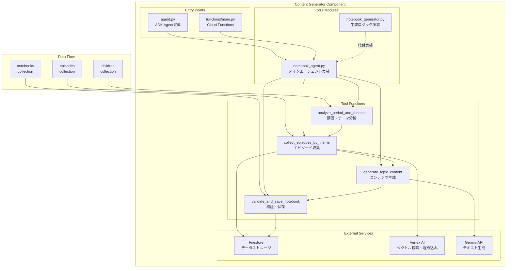
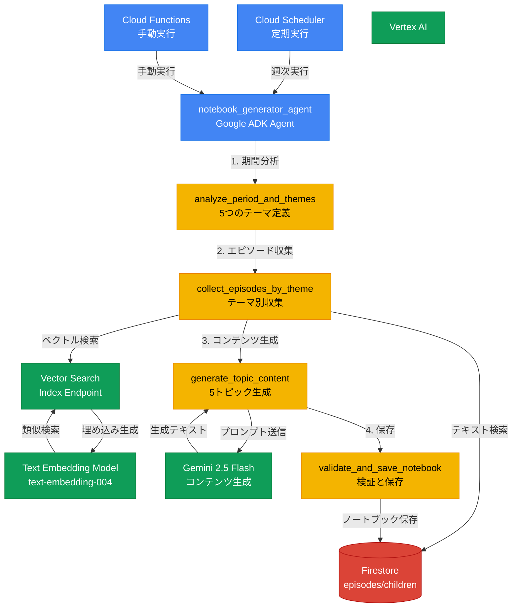

# Content Generator コンポーネント アーキテクチャ

## 概要

Content Generator は、子供の成長記録アプリケーションにおいて、**エピソード（日々の記録）から週次ノートブックを自動生成する**コンポーネントです。Google Cloud Platform のサービスと Google ADK (Agent Development Kit) を活用し、AI エージェントがベクトル検索とテーマ分析を行い、温かく親しみやすいコンテンツを生成します。

## 主要機能

1. **週次ノートブックの自動生成**
   - 期間と子供IDを基に、5つのテーマでコンテンツを生成
   - エピソードの収集、分析、文章生成を自動化

2. **テーマ別エピソード収集**
   - 「今週の興味」「行った場所」「初めての体験」「ベストショット」「できるようになったこと」の5テーマ
   - ベクトル検索とキーワードマッチングの併用

3. **AI によるコンテンツ生成**
   - Gemini モデルを使用した温かい文章の生成
   - 画像の自動選択とキャプション生成

## コンポーネント内部アーキテクチャ図



## システム全体でのアーキテクチャ図



## コンポーネント詳細

### 1. エントリーポイント

#### agent.py
- Google ADK を使用したエージェント定義
- 会話型インターフェースでのノートブック生成
- ツール関数の統合と実行フロー管理

#### functions/main.py
- Cloud Functions のエントリーポイント（テンプレート）
- HTTP リクエストハンドリング

### 2. コアモジュール

#### notebook_agent.py（メイン実装）
- ADK Agent インスタンスの定義
- 4つのツール関数の実装
- エージェント実行フローの管理
- Firestore、Vertex AI との連携

#### notebook_generator.py（代替実装）
- クラスベースの実装アプローチ
- より構造化されたデータモデル（dataclass使用）
- エピソード収集とコンテンツ生成の分離

### 3. ツール関数

1. **analyze_period_and_themes**
   - 入力: child_id, start_date, end_date
   - 出力: 5つのテーマと検索クエリ

2. **collect_episodes_by_theme**
   - テーマごとにエピソードを収集
   - テキスト検索とベクトル検索の併用
   - 期間フィルタリング

3. **generate_topic_content**
   - Gemini による文章生成
   - レイアウトタイプに応じた画像選択
   - 200-300文字の温かい文章

4. **validate_and_save_notebook**
   - コンテンツの検証
   - Firestore への保存
   - ステータス管理

## データフロー

1. **入力受付**
   ```
   child_id + 期間 → エージェント起動
   ```

2. **エピソード収集**
   ```
   Firestore (episodes) → フィルタリング → ベクトル検索 → テーマ別分類
   ```

3. **コンテンツ生成**
   ```
   エピソード群 → Gemini プロンプト → 文章生成 → 画像選択
   ```

4. **保存**
   ```
   検証 → Firestore (notebooks) → 完了通知
   ```

## 技術スタック

- **言語**: Python 3.12
- **フレームワーク**: Google ADK (Agent Development Kit)
- **AI/ML**: 
  - Vertex AI (ベクトル検索、埋め込み)
  - Gemini 2.0/2.5 Flash (テキスト生成)
- **データベース**: Firestore
- **デプロイ**: Cloud Functions / Cloud Run

## セキュリティ考慮事項

- 環境変数による認証情報管理
- PROJECT_ID の動的取得
- 子供IDによるアクセス制御
- エラーハンドリングとログ記録

## 今後の拡張可能性

1. **マルチメディア対応**
   - 動画からのハイライト抽出
   - 音声メモの文字起こし統合

2. **カスタマイズ機能**
   - テーマのカスタマイズ
   - 生成スタイルの調整

3. **分析機能**
   - 成長トレンド分析
   - 発達マイルストーン追跡