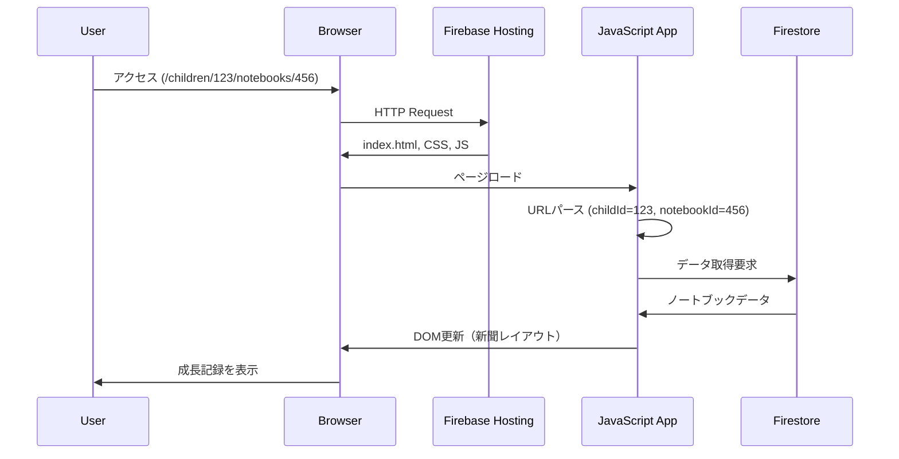

# DailyPublisher - 成長記録新聞風ビューアー

## 概要

DailyPublisherは、子どもの成長記録を新聞風のレイアウトで美しく表示するWebアプリケーションです。家族向けWebアプリケーションシステムの一部として、保護者が記録した5つのトピックを視覚的に魅力的な形式で共有できるようにします。

## システム全体における役割

本コンポーネントは、以下の役割を担います：

- **閲覧専用インターフェース**: Firestoreに保存された成長記録データの表示
- **共有機能**: URL経由での簡単な記録共有
- **ビジュアル変換**: 日々の記録を新聞スタイルの読みやすい形式に変換

## アーキテクチャ

```mermaid
graph TB
    subgraph "DailyPublisher Component"
        subgraph "Frontend (SPA)"
            HTML[index.html<br/>Entry Point]
            CSS[style.css<br/>Newspaper Layout]
            JS[JavaScript<br/>Firebase SDK v10.7.1]
        end
        
        subgraph "Routing"
            URL[URL Parser<br/>/children/:childId/notebooks/:notebookId]
        end
        
        subgraph "Data Layer"
            FS[Firestore Client<br/>Real-time Data]
        end
    end
    
    subgraph "External Services"
        FH[Firebase Hosting]
        DB[(Cloud Firestore<br/>Database)]
        ST[Firebase Storage<br/>Photos]
    end
    
    subgraph "Data Structure"
        DS[children/:childId/notebooks/:notebookId<br/>- nickname<br/>- date<br/>- topics[5]]
    end
    
    User[User/Browser] --> FH
    FH --> HTML
    HTML --> JS
    JS --> URL
    URL --> FS
    FS --> DB
    DB --> DS
    JS --> CSS
    
    DS -.-> |Photo URLs| ST
    ST -.-> |Images| JS
```

## 機能詳細

### 1. データ取得と表示
- URLパラメータから`childId`と`notebookId`を抽出
- Firestoreから対応するノートブックデータを取得
- 5つのトピックを新聞風レイアウトで表示

### 2. レイアウト構成
- **トピック1**: メインストーリー（大きな写真付き）
- **トピック2**: テキストセクション
- **トピック3**: サイドストーリー（小さな写真付き）
- **トピック4**: 写真セクション（中サイズ）
- **トピック5**: 達成事項・マイルストーン

### 3. UI/UX機能
- ローディングアニメーション
- エラーハンドリング（データ未検出時）
- レスポンシブデザイン（モバイル対応）
- 日本語日付フォーマット

## 技術スタック

- **Frontend**: Vanilla JavaScript (ES6+)
- **Styling**: CSS3 (Grid Layout, Flexbox)
- **Database**: Cloud Firestore
- **Hosting**: Firebase Hosting
- **Build**: 静的ファイル（ビルド不要）

## データフロー



## セットアップ

### 前提条件
- Firebase プロジェクトへのアクセス権
- Node.js（Firebase CLIのため）

### 環境変数
`.env.example`を参考に、必要な環境変数を設定してください。

### デプロイ
```bash
firebase deploy --only hosting
```

## ディレクトリ構造

```
dairy_publisher/
├── README.md           # このファイル
├── architecture.md     # 詳細設計ドキュメント
├── firebase.json       # Firebase設定
├── .env.example       # 環境変数テンプレート
└── public/            # 公開ディレクトリ
    ├── index.html     # SPAエントリーポイント
    └── style.css      # スタイルシート
```

## 今後の拡張予定

- Firebase Functions による PDF エクスポート機能
- Vertex AI を使用した自動要約生成
- 認証機能の追加（プライベート共有）
- PWA 対応（オフライン閲覧）

## 関連コンポーネント

- **Photo Web App**: 写真のアップロードと管理
- **データ入力アプリ**: 成長記録の作成・編集
- **管理画面**: システム全体の管理

## ライセンス

プロジェクトのライセンスに準拠