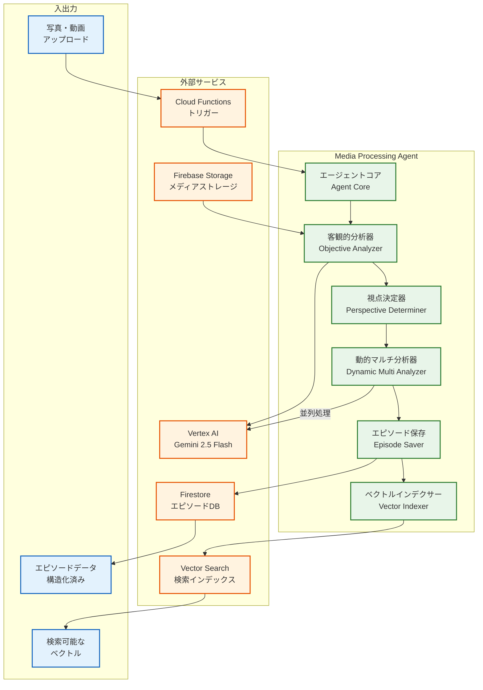
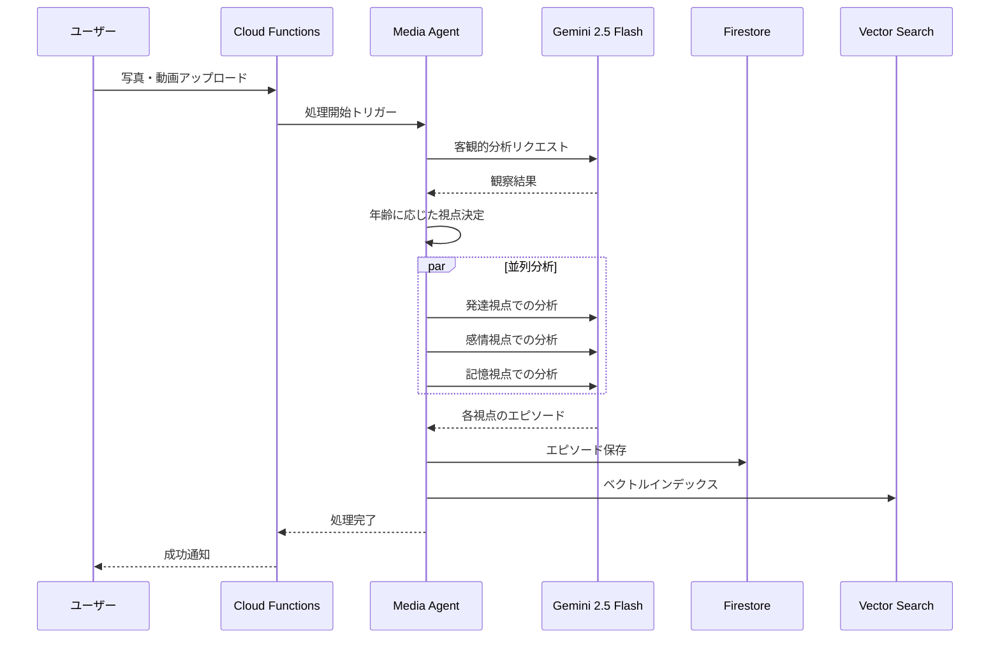

# Media Processing Agent

## 概要

Media Processing Agentは、子どもの写真や動画を分析して、成長の記録やエピソードを自動的に抽出するAIエージェントです。Google ADK (Agent Development Kit)を使用して構築され、Gemini 2.5 Flashモデルで映像を理解し、親が大切にしたい瞬間を構造化されたデータとして保存します。

## 主要機能

1. **マルチメディア分析**
   - 写真・動画から子どもの行動や表情を分析
   - 場面の文脈（場所、イベント、状況）を理解
   - 感情的な瞬間や特別な思い出を識別

2. **年齢に応じた多角的分析**
   - 子どもの月齢に基づいて適切な観察視点を自動選択
   - 発達段階に応じた成長記録の作成
   - 複数の視点から同時並行で分析

3. **エピソード生成と構造化**
   - 観察結果を意味のあるエピソードとして構造化
   - 感情に訴える日本語タイトルの生成
   - 検索しやすいタグとメタデータの付与

4. **セマンティック検索対応**
   - エピソードを768次元のベクトルに変換
   - Vertex AI Vector Searchでの高速検索を実現
   - 過去の似た場面や成長の軌跡を発見

## アーキテクチャ図



## データフロー



## 年齢別分析視点

| 月齢 | 分析視点 | 注目ポイント |
|------|----------|------------|
| 0-6ヶ月 | 感覚発達、基本的運動、親子の愛着 | 首すわり、寝返り、微笑み |
| 6-12ヶ月 | 運動発達、物体認識、初期言語 | ハイハイ、つかまり立ち、初語 |
| 12-24ヶ月 | 歩行、言語発達、社会性 | 初歩、2語文、他者認識 |
| 24ヶ月+ | 複雑な遊び、感情理解、仲間関係 | ごっこ遊び、感情表現、友達 |

## 技術スタック

- **プログラミング言語**: Python 3.12
- **AIフレームワーク**: Google ADK (Agent Development Kit)
- **AI/MLモデル**:
  - Gemini 2.5 Flash (画像・動画分析)
  - text-embedding-004 (ベクトル化)
- **クラウドサービス**:
  - Google Cloud Platform
  - Vertex AI
  - Cloud Firestore
  - Cloud Functions
  - Firebase Storage

## エピソードデータ構造

```json
{
  "media_uri": "gs://bucket/path/to/media.jpg",
  "child_id": "child_123",
  "child_age_months": 18,
  "user_id": "user_456",
  "emotional_title": "初めて一人で立った瞬間",
  "episodes": [
    {
      "id": "episode_001",
      "type": "developmental",
      "title": "運動発達の大きな一歩",
      "summary": "つかまらずに3秒間立つことができた",
      "content": "リビングで一人で立ち上がり...",
      "tags": ["立つ", "運動発達", "18ヶ月"],
      "metadata": {
        "confidence": 0.95,
        "emotion_score": 0.8
      }
    }
  ],
  "episode_count": 3,
  "created_at": "2024-01-15T10:00:00Z",
  "captured_at": "2024-01-14T15:30:00Z"
}
```

## 主要コンポーネント

### 1. エージェントコア (Agent Core)
- ADKフレームワークの管理
- 処理フローの制御
- エラーハンドリングとリトライ

### 2. 客観的分析器 (Objective Analyzer)
- メディアファイルの内容抽出
- 場面・状況の客観的記述
- 子どもの行動・表情の識別

### 3. 視点決定器 (Perspective Determiner)
- 子どもの月齢から適切な分析視点を選択
- 並列処理する視点の数を決定

### 4. 動的マルチ分析器 (Dynamic Multi Analyzer)
- 複数視点での並列分析
- 各視点に特化したプロンプト生成
- エピソードの統合と重複排除

### 5. ベクトルインデクサー (Vector Indexer)
- テキストエンベディングの生成
- Vector Searchへのインデックス登録
- 検索用メタデータの付与

## Cloud Functions エンドポイント

### 1. `process_media_upload` (HTTP)
```bash
POST /process_media_upload
{
  "media_uri": "gs://bucket/path/to/media.jpg",
  "child_id": "child_123",
  "child_age_months": 18,
  "user_id": "user_456"
}
```

### 2. `process_media_upload_firestore` (Firestore Trigger)
- トリガー: `media_uploads/{docId}` ドキュメント作成時
- 自動的にメディア処理を開始

### 3. `generate_notebook_http` (HTTP)
```bash
POST /generate_notebook
{
  "child_id": "child_123",
  "start_date": "2024-01-01",
  "end_date": "2024-01-07"
}
```

## 環境変数

| 変数名 | 説明 | 例 |
|--------|------|-----|
| `GCP_PROJECT_ID` | GCPプロジェクトID | hackason-464007 |
| `GCP_LOCATION` | GCPリージョン | us-central1 |
| `VERTEX_AI_VECTOR_SEARCH_INDEX_ID` | Vector SearchインデックスID | (設定値) |
| `VERTEX_AI_VECTOR_SEARCH_INDEX_ENDPOINT_ID` | Vector SearchエンドポイントID | (設定値) |
| `DEV_MODE` | 開発モード（DB書き込みスキップ） | true/false |

## セットアップ

```bash
# 依存関係のインストール
pip install -r requirements.txt

# ADKエージェントのローカル実行
adk agents local --project hackason-464007

# Cloud Functionsのデプロイ
cd functions
gcloud functions deploy process_media_upload \
  --runtime python312 \
  --trigger-http \
  --allow-unauthenticated
```

## 開発とテスト

```bash
# ユニットテスト実行
python -m pytest tests/

# 開発モードでの実行（DBスキップ）
export DEV_MODE=true
python -m agent.main

# ログ確認
gcloud logging read "resource.type=cloud_function"
```

## 関連コンポーネント

- **Content Generator Agent**: このエージェントが生成したエピソードを基に成長日記を作成
- **Dairy Publisher**: 生成されたコンテンツを配信
- **Mobile App**: 親がエピソードを閲覧
- **Photo Web App**: 写真・動画のアップロード

## トラブルシューティング

### メディア処理が失敗する場合
1. メディアファイルのアクセス権限を確認
2. Vertex AIのクォータを確認
3. Cloud Functionsのログを確認

### Vector Searchのインデックスエラー
1. インデックスIDとエンドポイントIDの設定を確認
2. インデックスのデプロイ状態を確認
3. エンベディングの次元数（768）を確認

## ライセンス

このプロジェクトは内部使用のみを目的としています。