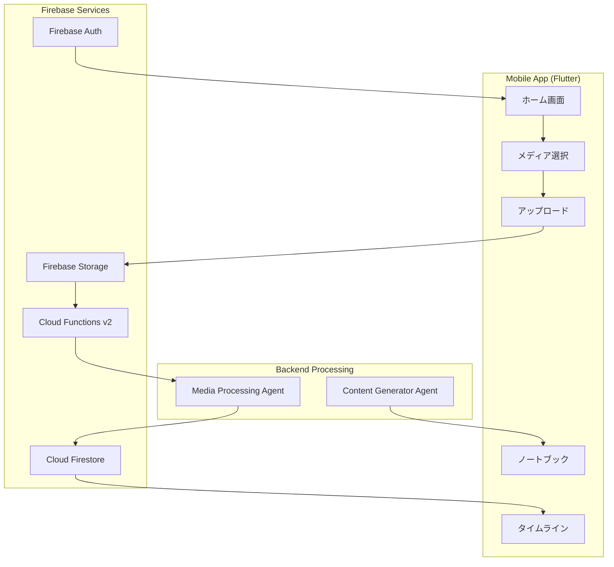

# Mobile App - 子育て思い出記録アプリ

## 概要

このFlutterアプリケーションは、子どもの日常の写真や動画を簡単にアップロードし、AIが自動的に分析・整理する子育て支援アプリです。Cloud Functions（Firebase Functions v2）と連携して、メディアの処理やノートブック生成を行います。

## 主要機能

### 1. メディアアップロード機能
- 写真・動画の選択とアップロード
- Firebase Storageへの直接アップロード
- アップロード進捗の表示
- 自動的なメディア分析の開始

### 2. AIによる自動分析
- Cloud Functionsと連携したメディア処理
- シーンや行動の自動認識
- 感情的なタイトルの生成
- 年齢に応じた多角的な分析

### 3. タイムライン表示
- 時系列での思い出の閲覧
- 動画のサムネイル表示
- 感情的なタイトルでの表示
- 日付ごとのグルーピング

### 4. 週刊ノートブック
- 1週間の思い出をまとめた自動生成レポート
- WebViewでの美しい表示
- PDFエクスポート機能（予定）

## アーキテクチャ



## Cloud Functions連携

このアプリは以下のCloud Functions（Firebase Functions v2）と連携します：

### 1. `process_media_upload` (HTTPトリガー)
メディアアップロード時に呼び出される関数
```dart
// 使用例
final response = await http.post(
  Uri.parse('https://process-media-upload-xxxxx.cloudfunctions.net/'),
  body: jsonEncode({
    'doc_id': uploadDocId,
    'media_uri': mediaUri,
    'child_id': childId,
    'child_age_months': ageMonths,
    'user_id': userId,
    'captured_at': capturedAt.toIso8601String(),
  }),
);
```

### 2. `process_media_upload_firestore` (Firestoreトリガー)
`media_uploads`コレクションへのドキュメント作成時に自動実行

### 3. `generate_notebook_http` (HTTPトリガー)
週刊ノートブック生成時に呼び出される関数

## データモデル

### MediaUpload
```dart
class MediaUpload {
  final String id;
  final String mediaUri;
  final String userId;
  final String childId;
  final int? childAgeMonths;
  final String processingStatus; // pending, processing, completed, failed
  final String? mediaId;
  final String? emotionalTitle;
  final String? thumbnailUrl; // 動画のサムネイル
  final DateTime? capturedAt;
  final DateTime createdAt;
}
```

### AnalysisResult
```dart
class AnalysisResult {
  final String mediaId;
  final String mediaUri;
  final String childId;
  final String emotionalTitle;
  final String? thumbnailUrl;
  final List<Episode> episodes;
  final DateTime capturedAt;
}
```

## セットアップ

### 1. 環境設定
```bash
# Flutter SDKのインストール
flutter doctor

# 依存関係のインストール
flutter pub get

# Firebase設定
flutterfire configure
```

### 2. 必要な設定ファイル
- `android/app/google-services.json`
- `ios/Runner/GoogleService-Info.plist`
- `lib/firebase_options.dart` (flutterfire configureで自動生成)

### 3. 環境変数
プロジェクトのルートに`.env`ファイルを作成：
```
FIREBASE_PROJECT_ID=your-project-id
CLOUD_FUNCTIONS_URL=https://us-central1-your-project.cloudfunctions.net
```

## 開発

### ローカル実行
```bash
# iOS
flutter run -d ios

# Android
flutter run -d android

# Web（デバッグ用）
flutter run -d chrome
```

### ビルド
```bash
# iOS
flutter build ios

# Android
flutter build apk
flutter build appbundle
```

### 静的解析
```bash
flutter analyze
```

## 状態管理

このアプリではProviderパターンを使用して状態管理を行っています：

- `AuthProvider`: 認証状態の管理
- `ChildrenProvider`: 子ども情報の管理
- `FamilyProvider`: 家族情報の管理
- `StorageProvider`: メディアアップロードの管理

## 主要な画面

1. **ログイン画面** (`login_screen.dart`)
   - Googleサインイン
   - メール/パスワード認証

2. **ホーム画面** (`home_screen.dart`)
   - メディアアップロード
   - 最近のアクティビティ

3. **タイムライン画面** (`unified_timeline_screen.dart`)
   - 時系列での思い出表示
   - 動画サムネイル対応

4. **ノートブック画面** (`weekly_notebook_screen.dart`)
   - 週ごとの思い出まとめ
   - WebView表示

## 最近の更新

### v2.0.0 - Cloud Functions v2対応
- Firebase Functions v2への移行に伴う呼び出し方法の更新
- 動画サムネイル表示機能の追加
- タイムライン画面での感情的タイトル表示

### v1.5.0 - メディア処理の改善
- アップロード状態のリアルタイム追跡
- エラーハンドリングの強化
- 処理状態の可視化

## トラブルシューティング

### アップロードが失敗する場合
1. ネットワーク接続を確認
2. Firebase Storageの権限設定を確認
3. ファイルサイズ制限（100MB）を確認

### 分析が完了しない場合
1. Cloud Functionsのログを確認
2. Firestoreの処理状態を確認
3. メディアファイルのアクセス権限を確認

## 貢献方法

1. Issueを作成して問題や提案を報告
2. フィーチャーブランチを作成
3. 変更をコミット
4. プルリクエストを作成

## ライセンス

このプロジェクトは内部使用のみを目的としています。