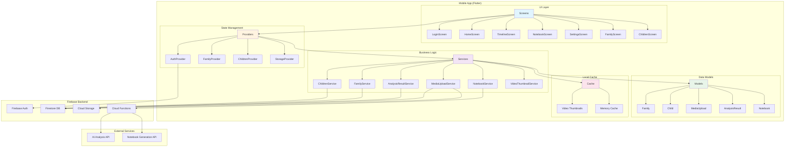

# Kids Diary Mobile アーキテクチャ概要

## 製品概要
Kids Diary（おまかせダイアリー）は、家族の写真・動画を管理し、AIが自動的に思い出を整理・分析するモバイルアプリケーションです。主に子供の成長記録を残すことを目的としており、週次で自動生成される連絡帳機能も備えています。

## 主要機能

### 1. 家族・子供管理
- 家族の作成・参加・管理
- 子供の情報登録（名前、生年月日、性別、関係性）
- 複数の子供の管理

### 2. メディア管理
- 写真・動画のアップロード
- 子供ごとのメディア分類
- サムネイル自動生成（動画）
- お気に入り、アーカイブ機能

### 3. AI分析機能
- アップロードされたメディアの自動分析
- 感情タイトルの生成
- エピソードの抽出（タグ、メタデータ付き）
- 子供の年齢に応じた内容分析

### 4. タイムライン
- 時系列でのメディア表示
- AI分析結果の統合表示
- 子供ごとのフィルタリング
- リアルタイム更新

### 5. 週次ノートブック
- 週単位での自動連絡帳生成
- トピックごとの写真整理
- 共有URL生成機能
- PDF出力（予定）

## 技術スタック

### フロントエンド
- **Flutter** (Dart)
- **Provider** (状態管理)
- **Material Design 3**

### バックエンド連携
- **Firebase**
  - Authentication (Google Sign-In)
  - Firestore (データベース)
  - Storage (メディアファイル保存)
  - Cloud Functions (API)

### 主要パッケージ
- `image_picker`: 写真・動画の選択
- `video_thumbnail`: 動画サムネイル生成
- `path_provider`: ローカルストレージアクセス
- `share_plus`: コンテンツ共有
- `exif`: 画像メタデータ読み取り

## アーキテクチャ図

## データフロー

### 1. メディアアップロードフロー
1. ユーザーが写真/動画を選択
2. `MediaUploadService`がCloud Storageにアップロード
3. Firestoreにメタデータを保存
4. Cloud Functionsがトリガーされ、AI分析を実行
5. 分析結果がFirestoreに保存
6. UIがリアルタイムで更新

### 2. ノートブック生成フロー
1. ユーザーが週を選択して生成リクエスト
2. `NotebookService`がCloud Functions APIを呼び出し
3. バックエンドが該当週のメディアを収集・分析
4. AIがトピックごとに整理したノートブックを生成
5. 結果がFirestoreに保存され、UIに反映

## セキュリティ・アクセス制御

### 認証
- Google Sign-Inによる認証
- Firebaseトークンベースの認証状態管理

### データアクセス制御
- 家族単位でのデータ隔離
- 家族メンバーのみがデータにアクセス可能
- 子供情報は所属家族メンバーのみ閲覧可能
- 家族作成者のみが管理者権限を持つ

## 状態管理パターン

### Provider パターン
- `ChangeNotifierProvider`による状態管理
- 各ドメインごとにProviderを分離
  - 認証状態: `AuthProvider`
  - 家族情報: `FamilyProvider`
  - 子供情報: `ChildrenProvider`
  - ストレージ: `StorageProvider`

### リアルタイム更新
- FirestoreのStreamによるリアルタイムデータ同期
- 変更が即座にUIに反映

## キャッシュ戦略

### 動画サムネイル
- メモリキャッシュ（一次キャッシュ）
- ディスクキャッシュ（二次キャッシュ）
- SHA-256ベースのキャッシュキー
- 30日経過後の自動クリーンアップ

## 今後の拡張予定

1. **ニュースレター機能**
   - 写真から自動ニュースレター生成
   - 編集・管理機能
   - PDF出力

2. **共有機能の強化**
   - 家族間での直接共有
   - SNS連携

3. **オフライン対応**
   - ローカルデータキャッシュ
   - オフライン時の操作キュー

Thank you for letting me work