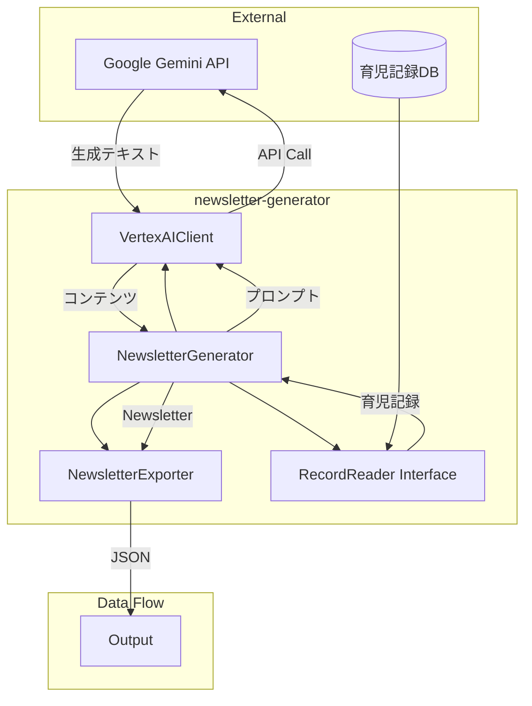
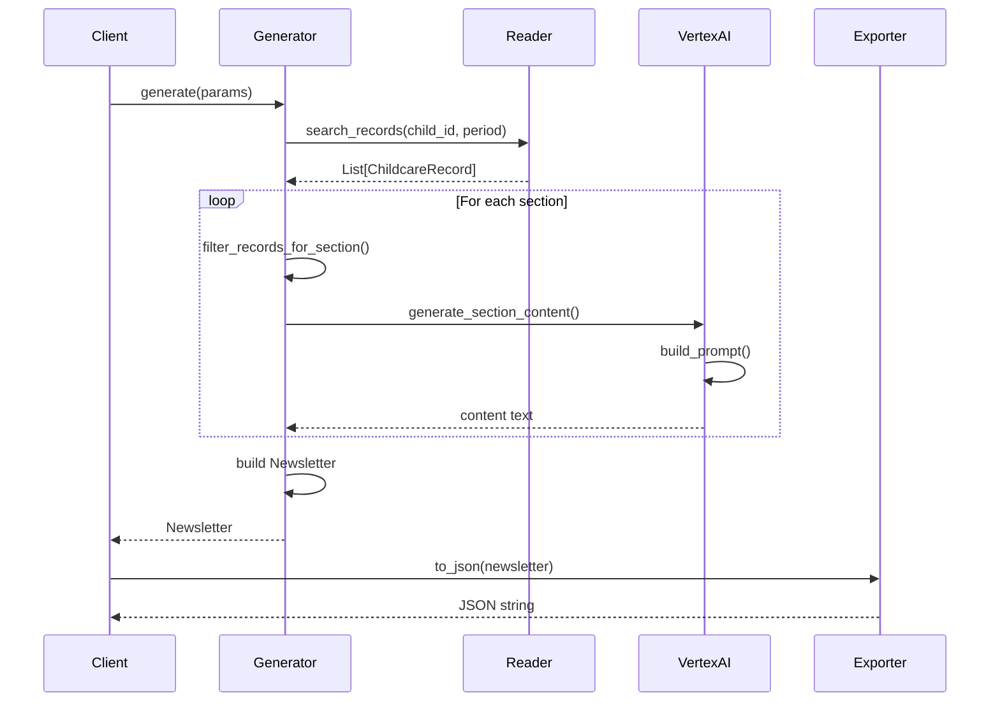

# AI連絡帳ジェネレーター アーキテクチャ

## システムアーキテクチャ

### 全体構成

```
newsletter-generator/
├── src/newsletter_generator/    # メインパッケージ
│   ├── __init__.py             # パッケージエクスポート
│   ├── generator.py            # コンテンツ生成ロジック
│   ├── vertex_ai_client.py    # Gemini API クライアント
│   ├── exporter.py             # JSON出力機能
│   ├── types.py                # 型定義
│   ├── mock_record_reader.py  # テスト用モックデータ
│   ├── renderer.py             # レンダリング（将来の拡張用）
│   ├── template_engine.py      # テンプレート処理
│   └── templates/              # HTMLテンプレート（レガシー）
├── examples/                   # 実行サンプル
│   ├── basic_example.py       # 基本的な使用例
│   └── json_example.py        # JSON出力の確認例
├── main.py                    # エントリーポイント（開発用）
├── pyproject.toml             # パッケージ設定
├── Makefile                   # タスクランナー
└── docs/                      # ドキュメント
```

## コンポーネント図



## クラス構成

### 主要クラス

```python
# NewsletterGenerator
class NewsletterGenerator:
    """連絡帳生成のメインクラス"""
    - generate(params: GenerateParams) -> Newsletter
    - regenerate(params: RegenerateParams) -> Newsletter
    - _generate_sections_with_all_records()
    - _filter_records_for_section()

# VertexAIClient
class VertexAIClient:
    """Google Gemini API クライアント"""
    - generate_section_content()
    - generate_caption()
    - regenerate_content()

# NewsletterExporter
class NewsletterExporter:
    """JSON出力クラス"""
    - to_json(newsletter: Newsletter) -> str
    - to_dict(newsletter: Newsletter) -> dict
    - save_json(newsletter: Newsletter, path: Path)

# RecordReader (Protocol)
class ChildcareRecordReader:
    """育児記録リーダーのインターフェース"""
    - search_records()
    - get_records_by_ids()
    - get_records_by_activity_type()
```

### データフロー

1. **入力段階**
   ```
   GenerateParams
   ├── ChildProfile (子ども情報)
   ├── Period (期間)
   ├── RecordReader (記録取得)
   └── Layout (オプション)
   ```

2. **処理段階**
   ```
   全記録取得
   ↓
   セクション別フィルタリング
   ↓
   AIコンテンツ生成
   ↓
   Newsletter構築
   ```

3. **出力段階**
   ```
   Newsletter
   ↓
   JSON変換
   ↓
   ファイル保存/API応答
   ```

## 処理シーケンス



## ファイルの役割

### main.py（ルートディレクトリ）

```python
# 開発・デバッグ用のエントリーポイント
# 直接実行してパッケージの動作を確認
# 本番環境では使用されない

if __name__ == "__main__":
    # 簡易的な動作確認
    asyncio.run(quick_test())
```

**用途:**
- パッケージの動作確認
- 開発中のデバッグ
- 簡易テスト

### examples/basic_example.py

```python
# 実際の使用例を示すサンプルコード
# ユーザーが参考にする実装例
# ドキュメントとしての役割

async def main():
    # 実際の使用方法を詳細に記述
    generator = NewsletterGenerator()
    # ... 詳細な実装例
```

**用途:**
- 使用方法の例示
- ベストプラクティスの提示
- ドキュメントの補完

### 違いのまとめ

| 項目 | main.py | examples/*.py |
|------|---------|---------------|
| 目的 | 開発・デバッグ | 使用例の提示 |
| 対象者 | 開発者 | パッケージ利用者 |
| 内容 | 最小限の動作確認 | 詳細な実装例 |
| 本番使用 | × | 参考として○ |
| コミット | 必須ではない | 必須 |

## 拡張ポイント

### 新しいセクションタイプの追加

1. `types.py`にセクションタイプを追加
2. `generator.py`の`_filter_records_for_section()`にフィルタリングロジックを追加
3. `_get_section_title()`にタイトルを追加
4. `_get_section_instruction()`に生成指示を追加

### 新しい記録リーダーの実装

```python
class CustomRecordReader:
    async def search_records(self, ...):
        # カスタム実装
    
    async def get_records_by_ids(self, ...):
        # カスタム実装
```

### 出力形式の追加

```python
class NewsletterXMLExporter:
    def to_xml(self, newsletter: Newsletter) -> str:
        # XML形式への変換
```