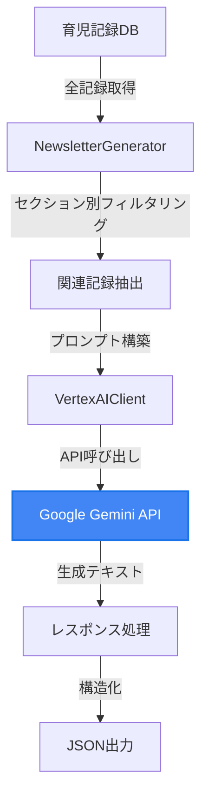

# AI連絡帳ジェネレーター

## 概要

AI連絡帳ジェネレーターは、保育園の日々の育児記録から、AIを活用して保護者向けの連絡帳コンテンツを自動生成するPythonパッケージです。Google Gemini APIを使用し、子どもの成長や日々の様子を温かみのある文章で表現します。

## 機能

### 主要機能

1. **育児記録の分析と整理**
   - 大量の育児記録から関連情報を抽出
   - セクションタイプに応じた記録のフィルタリング
   - 時系列での記録管理

2. **AIによるコンテンツ生成**
   - Google Gemini APIを使用した文章生成
   - 保育士視点での温かみのある表現
   - 子どもの成長や特徴を捉えた内容

3. **構造化されたJSON出力**
   - 標準化されたデータ形式
   - 他システムとの連携が容易
   - メタデータ付きで詳細な情報を保持

## AI/LLM活用の詳細

### LLMの役割

本システムでは、Google Gemini API（Gemini 1.5 Flash）を使用して、育児記録から意味のある文章を生成しています。

### 入力（プロンプト）の構成

#### 1. コンテキスト設定
```
あなたは保育士の視点で、{子ども名}ちゃん（{年齢}）の連絡帳を作成するアシスタントです。

【重要な指示】
- 提供された育児記録のみを使用して文章を作成してください
- 記録にない情報を創作したり、推測したりしないでください
- 記録の内容を要約し、保護者に伝わりやすい形で表現してください
```

#### 2. セクション別の指示
各セクションタイプに応じた具体的な生成指示：

| セクション | LLMへの指示 |
|-----------|-------------|
| overview | 今月/今週の全体的な様子を要約してください |
| activities | 行った活動について、記録から抽出して記述してください |
| favorite-play | 子どもが特に楽しんでいた遊びについて、具体的な様子を記述してください |
| first-time | 初めての体験について、記録から抽出して記述してください |
| growth-moment | 成長が見られた瞬間について、記録から具体的に記述してください |

#### 3. 育児記録データ
```
【育児記録】
【記録1】2024-01-15 - 自由遊び
活動内容: ブロック遊び
観察記録:
  - 赤と青のブロックを選んで遊んでいた
  - ブロックを3つ重ねることに成功した
  - 崩れても何度も挑戦していた
子どもの様子:
  - 気分: 集中していた
  - 発した言葉: できた！, もっと
```

#### 4. 生成ガイドライン
```
以下の点を考慮して、保護者が読んで嬉しくなるような文章を生成してください：
- 記録に基づいた事実のみを記載
- 客観的でありながら温かみのある表現
- 具体的な成長の様子（記録から読み取れる範囲で）
- 年齢に応じた発達の視点
- 200文字程度で簡潔に
```

### 出力（LLMの生成結果）

#### テキストセクションの例
```
太郎ちゃん（3歳0ヶ月）は今月も元気に過ごしました！様々な活動に積極的に参加し、
電車ごっこではリーダーシップを発揮、豆まき豆入れや鬼作りでは楽しそうに制作活動に
取り組んでいました。ブロック遊びでは3つ重ねることに成功し、崩れても何度も挑戦する
粘り強さを見せてくれました。「できた！」と喜ぶ姿が印象的でした。
```

#### キャプション生成の例
**入力**: 記録データ + セクションタイプ
**出力**: `初めてのボールキック！嬉しそうに走ってた♪`

### LLM活用のポイント

1. **RAGパターンの採用**
   - 全育児記録から関連する記録を検索・抽出
   - 抽出した記録のみをLLMに渡すことで精度向上

2. **プロンプトエンジニアリング**
   - 保育士視点の設定
   - 創作を防ぐ明確な指示
   - セクション別の最適化された指示

3. **レート制限対策**
   ```python
   # セクション間に遅延を追加
   if i > 0:
       await asyncio.sleep(2.0)
   
   # リトライロジック with exponential backoff
   async def _retry_with_backoff(self, operation, operation_name: str):
       for attempt in range(self.max_retries):
           try:
               return await operation()
           except ResourceExhausted:
               delay = self.base_delay * (2 ** attempt)
               await asyncio.sleep(delay)
   ```

4. **トークン効率化**
   - 必要な記録のみを抽出してプロンプトに含める
   - 簡潔な指示文で的確な生成を促す

### 実際のプロンプト例（完全版）

```
あなたは保育士の視点で、太郎ちゃん（3歳0ヶ月）の連絡帳を作成するアシスタントです。

【重要な指示】
- 提供された育児記録のみを使用して文章を作成してください
- 記録にない情報を創作したり、推測したりしないでください
- 記録の内容を要約し、保護者に伝わりやすい形で表現してください

【セクション】overview

【育児記録】
【記録1】2024-01-30 - 自由遊び
活動内容: 電車ごっこ
観察記録:
  - 椅子を並べて電車を作った
  - 「しゅっぱつ」と言った
  - 友達を乗せた
子どもの様子:
  - 気分: リーダーシップ
  - 発した言葉: しゅっぱつ, でんしゃ

【記録2】2024-01-29 - 制作活動
活動内容: 豆まきの豆入れ作り
観察記録:
  - 紙コップに絵を描いた
  - シールを貼った
  - 「まめまき」と言った
子どもの様子:
  - 気分: 楽しそう
  - 発した言葉: まめまき, おに

... (全30件の記録)

【過去の成長記録】
最近のマイルストーン:
- 2023-12-15: 初めて一人で歩いた
- 2024-01-05: 3語文を話すようになった

以下の点を考慮して、保護者が読んで嬉しくなるような文章を生成してください：
- 記録に基づいた事実のみを記載
- 客観的でありながら温かみのある表現
- 具体的な成長の様子（記録から読み取れる範囲で）
- 年齢に応じた発達の視点
- 200文字程度で簡潔に

文章のみを出力してください。
```

### LLMの処理フロー



### セクションタイプ

| セクション | 説明 | コンテンツ |
|-----------|------|-----------|
| overview | 全体の様子 | テキストのみ |
| activities | 活動記録 | テキストのみ |
| favorite-play | お気に入りの遊び | テキスト＋写真 |
| growth-moment | 成長の瞬間 | テキスト＋写真 |
| places-visited | 訪れた場所 | テキストのみ |
| first-time | 初めての体験 | 写真＋キャプション |
| development | できるようになったこと | テキストのみ |
| best-shot | ベストショット | 写真＋キャプション |

## 実行方法

### 前提条件

- Python 3.12以上
- Google API Key（Gemini API用）
- uv パッケージマネージャー

### セットアップ

```bash
# リポジトリのクローン
git clone https://github.com/haratak/hackason.git
cd hackason/packages/newsletter-generator

# Python環境の初期化
make init

# 環境変数の設定
cp .env.example .env
# .envファイルを編集してGOOGLE_API_KEYを設定
```

### 実行

```bash
# 基本的な実行
make run

# または直接実行
uv run python examples/basic_example.py

# JSON形式の確認
uv run python examples/json_example.py
```

### ファイルの違い

#### main.py（ルートディレクトリ）
- **目的**: 開発・デバッグ用の簡易実行ファイル
- **用途**: パッケージの動作確認、開発中のテスト
- **対象**: 開発者向け
- **内容**: 最小限のコードで動作確認

```python
# 簡易的な動作確認用
if __name__ == "__main__":
    # 基本的な動作テスト
    asyncio.run(simple_test())
```

#### examples/basic_example.py
- **目的**: 実際の使用例を示すサンプルコード
- **用途**: ユーザーが参考にする実装例
- **対象**: パッケージ利用者向け
- **内容**: 詳細な実装例とベストプラクティス

```python
# 実際の使用方法を詳しく説明
async def main():
    # 環境変数の確認
    # 生成器の初期化
    # パラメータの設定
    # 連絡帳の生成
    # 結果の表示
    # エラーハンドリング
```

**使い分け**:
- 開発者がパッケージをテストする → `main.py`
- 利用者が実装方法を学ぶ → `examples/*.py`

### プログラムからの使用

```python
import asyncio
from newsletter_generator import (
    NewsletterGenerator,
    NewsletterExporter,
    GenerateParams,
    ChildProfile,
)

async def main():
    # 生成器の初期化
    generator = NewsletterGenerator()
    exporter = NewsletterExporter()
    
    # パラメータ設定
    params = GenerateParams(
        child_profile=ChildProfile(
            id="child-123",
            name="太郎",
            birth_date=datetime(2022, 6, 1),
            gender="male",
        ),
        period={
            "start": datetime(2024, 1, 1),
            "end": datetime(2024, 1, 31),
        },
        record_reader=your_record_reader,  # 育児記録リーダー
    )
    
    # 連絡帳生成
    newsletter = await generator.generate(params)
    
    # JSON出力
    json_data = exporter.to_json(newsletter)
    print(json_data)

asyncio.run(main())
```

## 出力形式

### JSON構造

```json
{
  "id": "1750806080_357f2782",
  "version": 1,
  "child_id": "child-123",
  "title": "太郎ちゃんの1月の成長記録",
  "period": {
    "start": "2024-01-01T00:00:00",
    "end": "2024-01-31T00:00:00"
  },
  "sections": [
    {
      "id": "sec-1",
      "type": "overview",
      "title": "今月の様子",
      "order": 1,
      "content": {
        "text": "太郎ちゃん（3歳0ヶ月）は今月も元気に過ごしました...",
        "metadata": {
          "record_count": 30,
          "record_ids": ["rec-001", "rec-002", ...]
        }
      }
    },
    {
      "id": "sec-2",
      "type": "favorite-play",
      "title": "お気に入りの遊び",
      "order": 3,
      "content": {
        "text": "ブロック遊びに夢中で...",
        "photo_url": "gs://bucket/photos/photo-123.jpg",
        "photo_description": "ブロック遊び"
      }
    },
    {
      "id": "sec-3",
      "type": "first-time",
      "title": "初めての体験",
      "order": 4,
      "content": {
        "photo_url": "gs://bucket/photos/photo-456.jpg",
        "caption": "初めてのボールキック！"
      }
    }
  ],
  "metadata": {
    "child_age": {"years": 3, "months": 0},
    "record_count": 30,
    "generation_params": {},
    "used_media_ids": ["photo-123", "photo-456"]
  },
  "generated_at": "2025-06-25T12:34:56"
}
```

### 出力の特徴

1. **標準化されたデータ構造**
   - 一貫性のあるスキーマ
   - 型安全性の確保
   - バージョン管理

2. **メタデータの充実**
   - 使用した育児記録のID
   - 生成パラメータ
   - メディアファイルの参照

3. **柔軟なコンテンツ形式**
   - テキストのみ
   - テキスト＋写真
   - 写真＋キャプション

## 全体プロダクトにおける位置づけ

### システム全体での役割

AI連絡帳アシスタントシステムにおいて、本パッケージは**コンテンツ生成エンジン**としての中核的な役割を担います。

```
┌─────────────────────┐
│   フロントエンド    │
│   (Web/Mobile)      │
└──────────┬──────────┘
           │
┌──────────▼──────────┐
│    APIゲートウェイ   │
└──────────┬──────────┘
           │
┌──────────▼──────────┐
│  newsletter-generator│ ← このパッケージ
│  (コンテンツ生成)   │
└──────────┬──────────┘
           │
┌──────────▼──────────┐
│   データストア      │
│  (育児記録DB)       │
└─────────────────────┘
```

### 責務

1. **育児記録の分析と整理**
   - RAGパターンによる関連記録の検索
   - セクション別の記録フィルタリング
   - 時系列データの処理

2. **AIコンテンツ生成**
   - プロンプトエンジニアリング
   - セクション別の最適な文章生成
   - 保育士視点の表現

3. **データ構造化**
   - 標準化されたJSON形式への変換
   - メタデータの付与
   - バージョン管理

### 他のコンポーネントとの連携

- **入力**: 育児記録データベースからの記録データ
- **処理**: Google Gemini APIを使用したコンテンツ生成
- **出力**: 構造化されたJSON形式の連絡帳データ
- **連携先**: 
  - フロントエンドアプリケーション（表示用）
  - PDFレンダリングサービス（印刷用）
  - 通知サービス（配信用）

## 今後の拡張性

- カスタムセクションタイプの追加
- 多言語対応
- テンプレートのカスタマイズ機能
- リアルタイム生成API
- バッチ処理対応