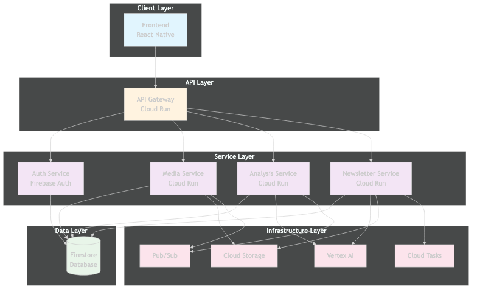
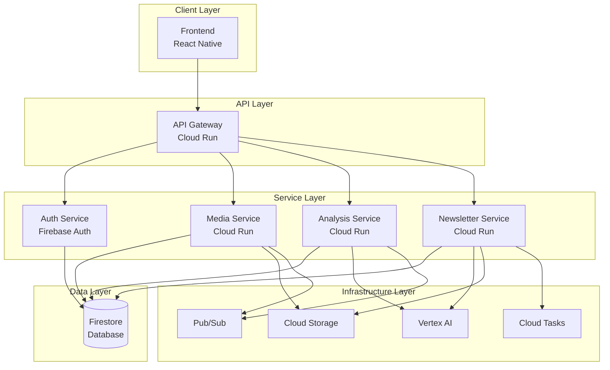
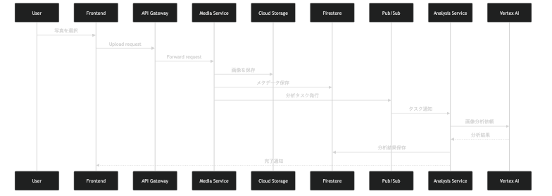
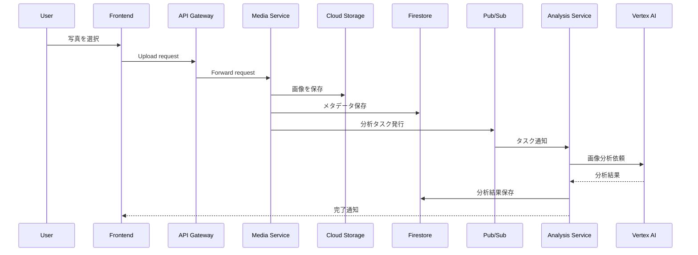
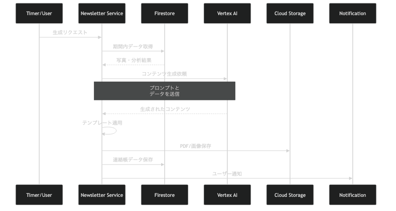
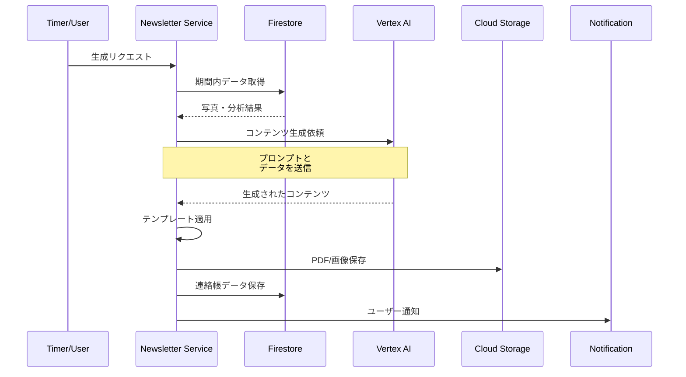
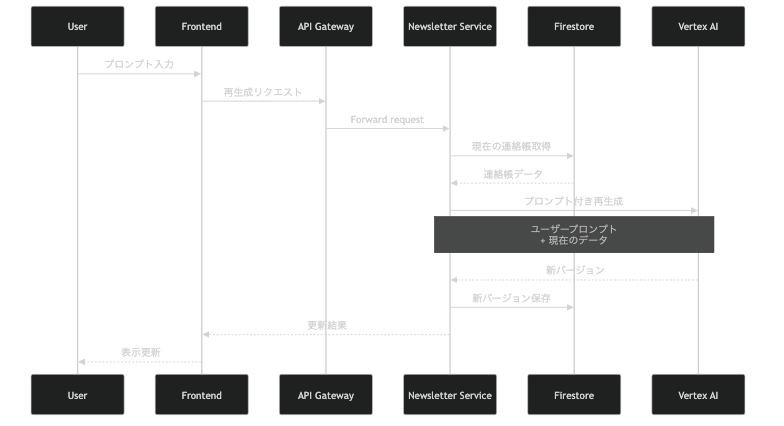
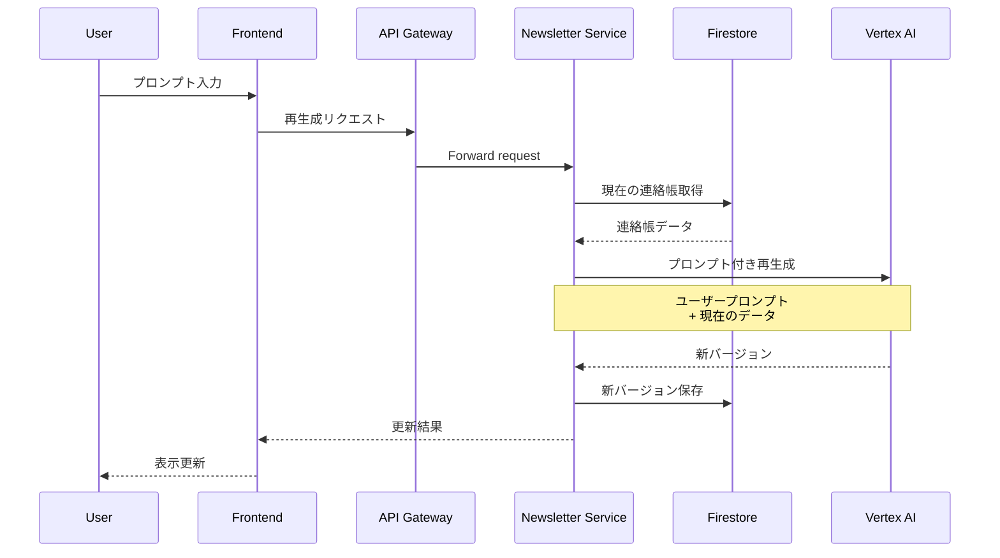
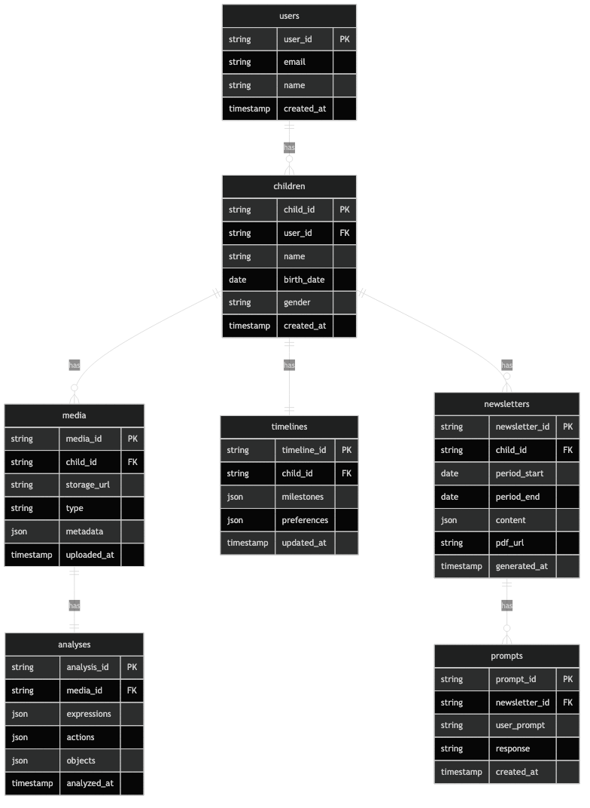
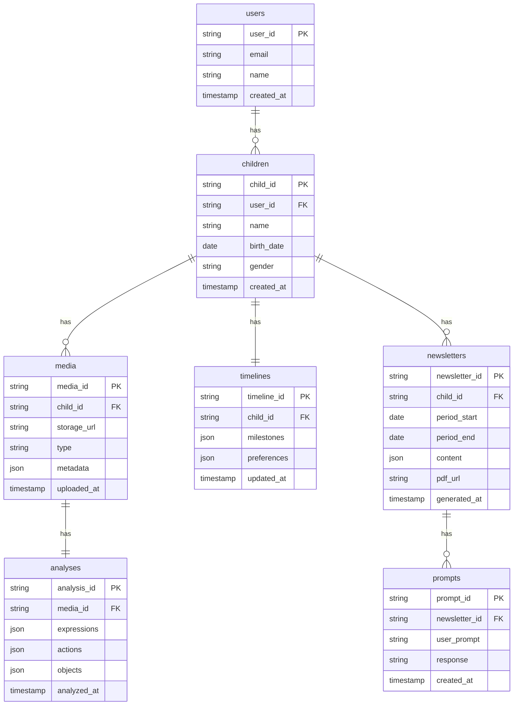

# AI連絡帳アシスタント システムアーキテクチャ詳細設計書

## 1. 概要

本ドキュメントは、AI連絡帳アシスタントのシステムアーキテクチャの詳細設計を定義します。

### 1.1 アーキテクチャ方針
- **クラウドネイティブ**: GCP上で完全に動作
- **マイクロサービス**: 機能ごとに分離されたサービス
- **スケーラブル**: 水平スケーリングが可能な設計
- **非同期処理**: 重い処理は非同期で実行

## 2. システム構成図

Mermaidソースコード

## 3. コンポーネント詳細

### 3.1 Frontend (React Native)
- **役割**: モバイルアプリケーションのUI/UX
- **技術スタック**: 
  - React Native
  - TypeScript
  - React Navigation
  - React Query (データフェッチング)
- **主要機能**:
  - 写真・動画の選択とアップロード
  - 連絡帳の表示・編集
  - AIとのチャット対話

### 3.2 API Gateway
- **役割**: APIの統一エントリーポイント
- **技術**: Cloud Run
- **機能**:
  - 認証・認可
  - ルーティング
  - レート制限
  - CORSハンドリング

### 3.3 認証サービス (Auth Service)
- **役割**: ユーザー認証・認可
- **技術**: Firebase Authentication
- **機能**:
  - ユーザー登録・ログイン
  - トークン管理
  - セッション管理

### 3.4 メディアサービス (Media Service)
- **役割**: 写真・動画の管理
- **技術**: Cloud Run + Cloud Storage
- **機能**:
  - メディアのアップロード受付
  - Cloud Storageへの保存
  - メタデータの抽出・保存
  - サムネイル生成
  - アップロード制限管理

### 3.5 分析サービス (Analysis Service)
- **役割**: AI分析の実行
- **技術**: Cloud Run + Vertex AI
- **機能**:
  - 画像・動画フレームの分析依頼受付
  - Vertex AI APIの呼び出し
  - 分析結果の構造化
  - タイムライン情報の更新
  - 成長マイルストーンの検出

### 3.6 連絡帳サービス (Newsletter Service)
- **役割**: 連絡帳の生成・管理
- **技術**: Cloud Run
- **機能**:
  - 定期的な連絡帳生成
  - テンプレートへのデータ適用
  - PDF/画像形式での出力
  - プロンプトによる再生成

## 4. データフロー

### 4.1 写真アップロードフロー

Mermaidソースコード

### 4.2 連絡帳生成フロー

Mermaidソースコード

### 4.3 AIとの対話フロー

Mermaidソースコード

## 5. データベース設計（概要）

### 5.1 主要コレクション
- **users**: ユーザー情報
- **children**: 子供プロファイル
- **media**: 写真・動画メタデータ
- **analyses**: AI分析結果
- **timelines**: 成長タイムライン
- **newsletters**: 生成された連絡帳
- **prompts**: ユーザープロンプト履歴

### 5.2 データ関係

Mermaidソースコード

## 6. 非同期処理設計

### 6.1 Cloud Tasks
- **用途**: 重い処理の非同期実行
- **対象タスク**:
  - 画像・動画の分析
  - PDF生成
  - 大量データの処理

### 6.2 Pub/Sub
- **用途**: サービス間の疎結合な通信
- **トピック**:
  - media-uploaded: メディアアップロード完了
  - analysis-completed: 分析完了
  - newsletter-requested: 連絡帳生成リクエスト

## 7. セキュリティ設計

### 7.1 認証・認可
- Firebase Authenticationによるトークンベース認証
- 各サービスでトークン検証
- ユーザーは自分のデータのみアクセス可能

### 7.2 データ保護
- Cloud Storage: 署名付きURL使用
- Firestore: セキュリティルール設定
- HTTPS通信の強制

### 7.3 アクセス制御
- IAMによるサービスアカウント権限管理
- 最小権限の原則

## 8. スケーラビリティ設計

### 8.1 水平スケーリング
- Cloud Run: 自動スケーリング設定
- 最小インスタンス: 0
- 最大インスタンス: 100（サービスごと）

### 8.2 パフォーマンス最適化
- CDN（Cloud CDN）による静的コンテンツ配信
- Firestoreインデックス最適化
- 画像の遅延読み込み

## 9. 監視・ログ設計

### 9.1 監視
- Cloud Monitoring: メトリクス監視
- アラート設定:
  - エラー率
  - レスポンスタイム
  - リソース使用率

### 9.2 ログ
- Cloud Logging: 統合ログ管理
- 構造化ログの採用
- トレースIDによるリクエスト追跡

## 10. 開発・デプロイ設計

### 10.1 CI/CD
- GitHub Actions: 自動ビルド・テスト
- Cloud Build: コンテナイメージビルド
- Cloud Run: 自動デプロイ

### 10.2 環境構成
- 開発環境 (dev)
- ステージング環境 (staging)
- 本番環境 (prod)

## 11. コスト最適化

### 11.1 リソース最適化
- Cloud Run: スケールtoゼロ
- Cloud Storage: ライフサイクルポリシー設定
- Firestore: 適切なインデックス設計

### 11.2 利用制限
- APIレート制限
- アップロード容量制限
- 分析頻度の制限

## 12. 技術選定理由

### 12.1 GCP選定理由
- Vertex AIとの統合が容易
- フルマネージドサービスの充実
- 自動スケーリング機能

### 12.2 React Native選定理由
- iOS/Android両対応
- 開発効率の高さ
- コミュニティの充実

### 12.3 Firestore選定理由
- リアルタイム同期
- オフライン対応
- スケーラビリティ

## 13. 今後の検討事項

- キャッシュ戦略の詳細設計
- バックアップ・リストア手順
- 災害復旧計画
- パフォーマンステストの実施方法