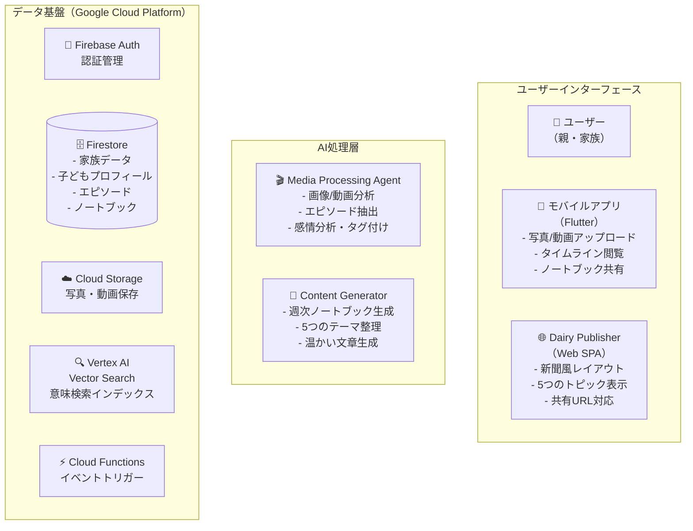
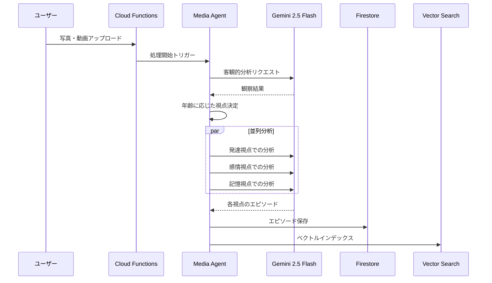

## はじめに

本記事は、Google Cloud主催の「第2回 AI Agent Hackathon」への提出作品です。

子育て中の誰もが経験する「スマホに溜まり続ける大量の写真や動画」。それらをただのデータとして眠らせるのではなく、家族の絆を深める「物語」へと昇華させたい。そんな思いから、**AIが子供の成長記録を自動で編集し、家族に届ける成長記録プラットフォーム「おまかせダイアリー」** を開発しました。

この記事では、Google Cloud PlatformのAIサービスとサーバーレスアーキテクチャを活用し、どのように技術的課題を解決したかを詳しく解説します。

## Ⅰ. 解決したい課題と技術的アプローチ

### 対象ユーザーと課題

- **ユーザー像:** 0歳〜6歳くらいの子供を持つ、子育てに忙しい親
- **共有先の相手:** 祖父母や、遠方に住む家族・親戚
- **解決すべき3つの課題:**

#### 1. 大量のメディアから意味のある瞬間を抽出する課題

**問題:** 毎日撮影される膨大な写真・動画から、本当に大切な瞬間を見つけ出すことは人力では困難

**技術的解決策:**
- **Gemini 2.5 Flash**によるマルチモーダル分析で写真・動画の内容を理解
- **年齢適応型AIエージェント**が子どもの発達段階に応じた観察視点を自動選択
- **並列処理アーキテクチャ**で複数の視点（発達・感情・記憶）から同時分析

```python
# 年齢に応じた動的な分析視点の例
perspectives = {
    "0-6ヶ月": ["感覚発達", "基本的運動", "親子の愛着"],
    "6-12ヶ月": ["運動発達", "物体認識", "初期言語"],
    "12-24ヶ月": ["歩行", "言語発達", "社会性"],
    "24ヶ月+": ["複雑な遊び", "感情理解", "仲間関係"]
}
```

#### 2. 関連する思い出を自動で結びつける課題

**問題:** 過去の似た場面や成長の軌跡を手動で探すのは非現実的

**技術的解決策:**
- **Vertex AI Vector Search**で768次元のセマンティック検索を実現
- **text-embedding-004**モデルで各エピソードをベクトル化
- 意味的に関連する過去のエピソードを自動で発見・関連付け

#### 3. 心温まる物語として伝える課題

**問題:** AIが生成する文章は事実誤認や不自然な表現を含みがち

**技術的解決策:**
- **2段階のAIエージェントアーキテクチャ**で品質を担保
- 第1段階：客観的事実のみを抽出する「分析官」エージェント
- 第2段階：事実を基に物語を紡ぐ「作家」エージェント


## Ⅱ. システムアーキテクチャと技術スタック

### 全体アーキテクチャ



### 採用した主要技術

- **AI/ML**: Gemini 2.5 Flash、Vertex AI Vector Search、text-embedding-004
- **エージェント開発**: Google Agent Development Kit (ADK)
- **サーバーレス基盤**: Cloud Functions、Firebase (Auth/Firestore/Storage/Hosting)
- **フロントエンド**: Flutter（モバイル）、Vanilla JS（Web閲覧用）

## Ⅲ. 技術的な実装のハイライト

### 1. マルチモーダルAI分析の実装

Media Processing Agentは、写真・動画から以下の情報を自動抽出します：

```json
{
  "emotional_title": "初めて一人で立った瞬間",
  "episodes": [
    {
      "type": "developmental",
      "title": "運動発達の大きな一歩",
      "summary": "つかまらずに3秒間立つことができた",
      "content": "リビングで一人で立ち上がり...",
      "tags": ["立つ", "運動発達", "18ヶ月"],
      "metadata": {
        "confidence": 0.95,
        "emotion_score": 0.8
      }
    }
  ]
}
```

### 2. AIエージェントの責務分離

開発当初、単一のプロンプトで全てを処理しようとしましたが、出力が不安定でした。そこで、エージェントの責務を明確に分離：

**分析官エージェント（客観性重視）:**
```
あなたは、子供の行動を観察し、その中で最も記憶に残る「ハイライトシーン」を
見つけ出すプロのドキュメンタリー映像編集者です。

【厳守事項】
- あなたの感想や解釈は含めず、観察された事実のみを記述
- 年齢や月齢の推測は行わない
- 映像に映っていない情報を創作しない
```

**作家エージェント（物語性重視）:**
- 分析官が抽出した客観的事実を基に物語を構築
- 子どもの実年齢や家族構成などのコンテキストを加味
- 親目線での温かい文章を生成

### 3. セマンティック検索による関連付け

Vertex AI Vector Searchを活用し、以下を実現：

```python
# エピソードのベクトル化と検索
embedding = generate_embedding(episode_text)  # 768次元
similar_episodes = vector_search.find_neighbors(
    embedding, 
    k=5,  # 上位5件の類似エピソード
    filter=f"child_id={child_id}"
)
```

これにより、「初めて立った」エピソードに対して「初めて歩いた」「つかまり立ちした」などの関連エピソードを自動で発見できます。

### 4. イベント駆動型アーキテクチャ

Cloud Functionsのトリガーを活用した非同期処理：



### 5. 新聞風レイアウトの実装

Dairy Publisherコンポーネントでは、CSS GridとFlexboxを活用し、レスポンシブな新聞風レイアウトを実現：

- トピック1: メインストーリー（大きな写真付き）
- トピック2-5: サブストーリー（異なるレイアウトパターン）
- Firebase Hostingでの静的配信により高速表示

## Ⅳ. プロジェクトのデモ動画
https://youtu.be/TafdbSHw6rs

## 実装で得られた知見

### 1. AIエージェントの設計原則

- **単一責任の原則**: 各エージェントは1つの明確な役割に特化
- **事実と解釈の分離**: 客観的データ抽出と創造的文章生成を別プロセスに
- **コンテキストの段階的付与**: 必要な情報を適切なタイミングで追加

### 2. スケーラビリティの考慮

- Cloud Functionsによる自動スケーリング
- 非同期処理による高速レスポンス
- Vertex AI Vector Searchによる高速類似検索（数百万エピソード対応可能）

### 3. プライバシーとセキュリティ

- Firebase Authenticationによる認証
- 家族単位でのデータ分離（Firestoreのセキュリティルール）
- 共有URLは推測困難なUUIDを使用

## まとめ

本プロジェクトでは、Google Cloud PlatformのAIサービスとサーバーレスアーキテクチャを最大限活用し、以下を実現しました：

1. **Gemini 2.5 Flash**による高精度なマルチモーダル分析
2. **Agent Development Kit**を活用した役割特化型AIエージェント設計
3. **Vertex AI Vector Search**による意味的な思い出の関連付け
4. **Cloud Functions**によるスケーラブルなイベント駆動処理
5. **Firebase**エコシステムによる迅速な開発とセキュアな運用

技術的な挑戦を通じて、AIを単なるツールとしてではなく、明確な役割を持つ「エージェント」として設計することの重要性を学びました。今後も、家族の絆を深める新しいコミュニケーションの形を技術で支えていきたいと思います。

私自身は今回テストと資料作成を行い、hara takuさんが実装全般を行いました。
ありがとうございます！！！
メインエンジニア：https://zenn.dev/hara_taku

#aiagentzenn #googlecloud
